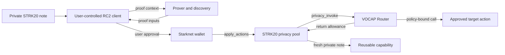
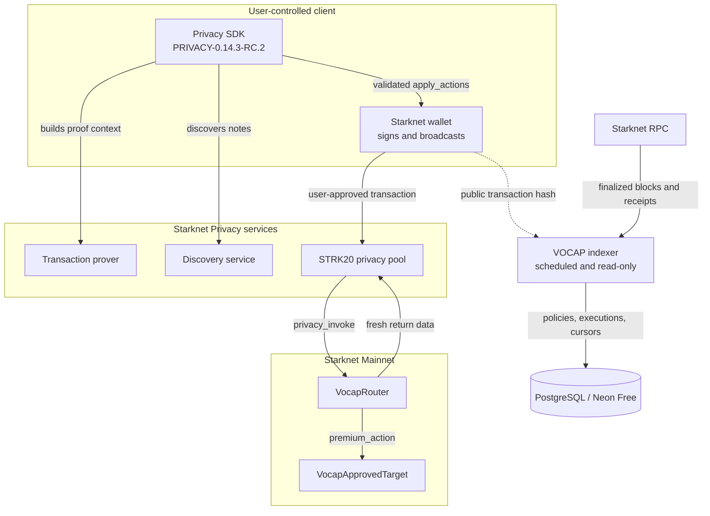

# VOCAP

A private STRK20 capability that triggers one approved Starknet action and returns the same value to a fresh private note.

Live demo: not available yet · Video: not available yet · [Docs](#architecture) · [Security](SECURITY.md) · Submission: not linked yet

There is no frontend screenshot yet. This is the current product flow:

```text
private STRK20 note
        |
user-controlled client builds proof and wallet call
        |
user approves transaction -> privacy pool -> policy-bound Router -> approved action
        |
fresh private STRK20 note
```

Built with: Starknet Privacy / STRK20 · Starknet Cairo · Starknet Foundry · PostgreSQL · Neon Free · GitHub Actions · Render (Sepolia)

Network: Starknet Mainnet

Status: Mainnet contracts and the proof-backed V1 lifecycle are working. The Mainnet indexer runs as a bounded, read-only scheduled projection. The frontend is not implemented yet.

Last verified: 2026-08-29.

## The problem

Private asset systems often stop at hiding ownership. They do not give that asset a narrow, enforceable rule for what it may do next.

A generic target call can use the wrong token, amount, contract, or selector. A target can also retain the capability instead of returning it. A server relayer may improve the broadcast experience, but it moves signing authority and private material into a backend.

VOCAP keeps the holder and note flow private while making the action policy explicit and enforceable. The user approves the write from their own wallet. The backend only observes public chain results.

## What VOCAP does

VOCAP lets a user apply a private STRK20 capability to one configured action. The Router checks the policy, calls the approved target, and requires the same capability amount to remain available for a fresh private return note.

V1 is deliberately narrow:

- one `RETURN` lifecycle;
- one policy-defined token and amount;
- one approved target and selector;
- empty target calldata for the reviewed Mainnet target;
- user-approved wallet writes;
- no signer, viewing key, or capability authority in the backend.

## How it works

1. The user selects a private STRK20 note and a V1 policy.
2. The user-controlled client uses the pinned RC2 SDK to discover the note and build the proof context.
3. The proving and discovery services provide the inputs needed for the private action. Private viewing material stays in the client process.
4. The wallet asks the user to approve the final `apply_actions` transaction.
5. The STRK20 pool calls `VocapRouter`. The Router checks the pool caller, policy, token, amount, target, selector, note, and reentrancy state before calling the approved target.
6. The Router requires the capability to remain available, grants the pool the return allowance, and the pool produces a fresh private note. The backend later indexes the finalized public receipt.



## Why Starknet Privacy matters

The STRK20 privacy flow carries the note, proof, and private succession path. That gives VOCAP a useful separation of concerns: holder state can stay private while the policy boundary remains public and checkable on Starknet.

The active client uses the official [`PRIVACY-0.14.3-RC.2`](https://github.com/starkware-libs/starknet-privacy/releases/tag/PRIVACY-0.14.3-RC.2) release at commit `9bfeb8dd35565a2915a0617dff3f649bd5bb891a`. The SDK builds the proof context and `apply_actions` call. The privacy pool owns the note lifecycle. VOCAP adds the policy-bound target call and the return requirement.

The RC2 client suite passed 259 tests across 28 files. The live prover and discovery checks returned HTTP `200`, RC2 protocol responses, and a valid proof context. Their running endpoints do not expose immutable image digests or revisions, so service-image provenance remains an explicit limitation.

## Try it

There is no browser flow to try yet. The fastest judge path is:

1. Open [`strk20.json`](strk20.json) and follow any of the three Mainnet proof transactions in the next section.
2. Run `snforge test` in `contracts/` to see the policy and failure-path suite.
3. Run `corepack pnpm test` in `backend/` to see the indexer and wallet-boundary tests.
4. Check the supervised Sepolia indexer at [`/healthz`](https://vocap-sepolia-indexer.onrender.com/healthz). This service is testnet-only and may wake from sleep on the first request.

The complete reproducible commands are in [Run locally](#run-locally).

## Product / Demo

The frontend is still to be built, so there is no live browser demo, screenshot set, or video. The working product surface is the user-approved private transaction path and its public evidence:

| Surface | Status |
| --- | --- |
| Mainnet private lifecycle | Completed with seven private-pool calls and three Router executions |
| Mainnet proof record | [`strk20.json`](strk20.json) with three qualifying transaction hashes |
| Sepolia indexer health | [`vocap-sepolia-indexer.onrender.com/healthz`](https://vocap-sepolia-indexer.onrender.com/healthz), live check returned HTTP `200` with `status: ok` |
| Browser frontend | Not implemented yet |
| Demo video | Not available yet |

## Architecture



The write path belongs to the user-controlled client, wallet, and privacy pool. The read path belongs to the RPC, scheduled indexer, and PostgreSQL projection. The two paths meet only through public transaction and receipt data.

## Integration details

| Technology | How we use it | Why it matters |
| --- | --- | --- |
| Starknet Privacy SDK `PRIVACY-0.14.3-RC.2` | Builds proof context, note actions, and the final pool call | Keeps private note handling in the user-controlled client and fixes the release family used for the proof path |
| STRK20 privacy pool | Receives the proven action, calls the Router, and returns a fresh note | Owns the private asset lifecycle while the Router enforces the public action policy |
| Starknet Cairo | Implements `VocapRouter` and `VocapApprovedTarget` | Enforces pool-only entry, exact policy binding, target success, reentrancy protection, and capability return |
| Starknet wallet | Reviews, signs, and broadcasts the final transaction | Keeps write approval with the user instead of a server signer |
| Starknet RPC | Supplies finalized blocks and receipts to the indexer | Keeps the chain receipt authoritative for the public projection |
| PostgreSQL / Neon Free | Stores policies, executions, lifecycle rows, and sync cursors | Provides a replayable projection without custody of private material |
| GitHub Actions | Runs bounded Mainnet catch-up jobs on a schedule | Supports a low-cost delayed indexer with separate migration and runtime roles |
| Render | Hosts the supervised Sepolia indexer and health endpoint | Provides a simple testnet deployment path without being used as Mainnet write infrastructure |

## What's running

| Item | Current record |
| --- | --- |
| Chain | `SN_MAIN` |
| `VocapRouter` | `0x6048ed36607367ea5ae050c745d47006214ecf66fdbf173d01eba96ec5d780a` |
| `VocapApprovedTarget` | `0x74637f577350898c64835c88216df3030050828c723c6987a3d97d6d4eb986b` |
| STRK20 privacy pool | `0x040337b1af3c663e86e333bab5a4b28da8d4652a15a69beee2b677776ffe812a`, version `2.0` |
| Mainnet policy | Policy `1`, Mainnet STRK, `1 STRK`, selector `premium_action`, empty target calldata |
| Pool protocol fee | `6 STRK` per `apply_actions` call, with a `450`-block proof window |
| Mainnet indexer | [Protected workflow](.github/workflows/vocap-mainnet-indexer.yml), scheduled bounded catch-up, no signer |
| Mainnet indexer state | Three successful GitHub Actions runs processed through block `14044147` with zero execution failures |
| Sepolia service | [`vocap-sepolia-indexer.onrender.com`](https://vocap-sepolia-indexer.onrender.com/), `/healthz`, testnet-only |
| Active client | `PRIVACY-0.14.3-RC.2` at `9bfeb8dd35565a2915a0617dff3f649bd5bb891a` |

The three qualifying Mainnet Router transactions are:

1. [`0x3e1acf0c893cb5697d48295d629e86fdddd1f8ff1fd1d307c7f2ecab8c7616f`](https://starkscan.co/tx/0x3e1acf0c893cb5697d48295d629e86fdddd1f8ff1fd1d307c7f2ecab8c7616f)
2. [`0x290d3683e674714a79676be0fc13819fc410e0b7e3abb2551529e28a52f83e0`](https://starkscan.co/tx/0x290d3683e674714a79676be0fc13819fc410e0b7e3abb2551529e28a52f83e0)
3. [`0xd4be56bfd8b0402e150ced5ee7f8b9c912722f9e4e940d1cc1eda7ee2098d3`](https://starkscan.co/tx/0xd4be56bfd8b0402e150ced5ee7f8b9c912722f9e4e940d1cc1eda7ee2098d3)

Each receipt is `SUCCEEDED` and `ACCEPTED_ON_L2`. The proof hashes and both deployed addresses are also recorded in [`strk20.json`](strk20.json).

## Evidence

| Evidence | Result |
| --- | --- |
| Cairo build and contract tests | `scarb build` passed. `snforge test` passed 26 tests. |
| Backend checks | Typecheck and build passed. Vitest passed 39 tests, with 1 guarded PostgreSQL test skipped when no database URL is set. |
| PostgreSQL integration | The forced disposable-database test passed 1 migration, replay, cursor, lifecycle, and reorganization case. |
| Privacy SDK | The exact RC2 checkout built successfully and passed 259 tests across 28 files. |
| RC2 proof path | Mainnet service checks returned HTTP `200`, OHTTP keys, prover spec `0.10.3-rc.2`, 9 proof facts, and an `apply_actions` call with 18 output words. |
| Mainnet lifecycle | Seven private-pool calls succeeded. The sequence covered registration, deposit, three Router executions, private Alice-to-Bob succession, and Bob's execution. |
| Target effect | `VocapApprovedTarget` action count advanced from `0` to `3`. |
| Replay safety | Alice's spent-note reuse was rejected before wallet submission. Exact block replays are ignored by the indexer projection. |
| Mainnet indexer | Runs `33249047016`, `33249526648`, and `33251549194` passed setup and restricted runtime-role checks, processed through block `14044147`, and reported zero execution failures. |
| Completed sequence cost | The approved run debited `80.524484515641070364 STRK` from the operator wallet. This is measured historical cost for that sequence, not a quote for future activity. |
| Testnet service | The supervised Render Sepolia deployment completed migration. A live `/healthz` check returned HTTP `200` with `status: ok`. |

## Failure cases / What we tested

| Attempt | Expected behavior | Result |
| --- | --- | --- |
| Direct call to `privacy_invoke` | Reject a caller that is not the configured pool | `ONLY_POOL` rejection covered by Cairo tests |
| Wrong token, amount, target, selector, or note | Reject values that do not match the policy | `WRONG_*` and `INVALID_*` rejections covered by Cairo and backend tests |
| Disabled policy | Stop before any target call | `POLICY_DISABLED` rejection covered by Cairo tests |
| Target reverts | Revert the complete action atomically | `TARGET_CALL_FAILED` covered by Cairo tests |
| Target retains the capability asset | Refuse to produce a return note | `RETURN_FAILED` covered with and without token surplus |
| Reentrant target attempts a second action | Block the nested call | Reentrancy guard covered by Cairo tests |
| Unsolicited token surplus | Preserve the surplus without blocking a valid return | Execution succeeds and the stale surplus cannot fund the next invocation |
| Reverted or unfinalized receipt | Keep it out of the successful projection | Finalized-success filtering covered by backend tests |
| Exact block replay | Avoid duplicate policies or executions | PostgreSQL replay is idempotent |
| Block gap or reorganization | Fail closed instead of rewriting history | Cursor continuity rejection covered by backend tests |

## Repository structure

```text
contracts/                         Cairo Router, target, and Starknet Foundry tests
backend/                           TypeScript indexer, persistence, health, and wallet boundary
.github/workflows/                 Protected Mainnet indexer workflow
render.yaml                        Supervised Sepolia deployment blueprint
.env.example                       Public configuration shape with no secrets
strk20.json                        Verified Mainnet proof hashes and contract addresses
LICENSE                            MIT license
```

The local `docs/` directory is intentionally ignored. It contains personal operator records and is not part of the public repository.

## Run locally

### Cairo contracts in WSL 2

Use the pinned toolchain from `.tool-versions`:

```text
wsl.exe -d Ubuntu
cd /mnt/c/Users/<windows-user>/Desktop/VOCAP/contracts
export PATH="$HOME/.local/bin:$HOME/.asdf/shims:$PATH"
scarb build
snforge test
```

### Backend

The backend uses Node.js 24 and Corepack pnpm:

```text
cd /mnt/c/Users/<windows-user>/Desktop/VOCAP/backend
corepack pnpm install --frozen-lockfile
corepack pnpm typecheck
corepack pnpm test
corepack pnpm build
```

The PostgreSQL integration test is guarded by default. Run it against a disposable database when needed:

```text
VOCAP_TEST_DATABASE_URL=postgresql://... VOCAP_REQUIRE_POSTGRES=1 corepack pnpm test:postgres
```

Running the indexer requires a migrated PostgreSQL schema, an explicit Starknet network, a matching RPC URL, a Router address, and a start block. The backend accepts no signer configuration.

## Limitations

- The frontend is not implemented. There is no browser demo, screenshot set, or demo video yet.
- V1 supports `RETURN` only. The reviewed target takes no arguments, and arbitrary target calldata is outside the current policy.
- The Mainnet backend is a delayed projection. Scheduled GitHub jobs and Neon Free can pause or lag, so the chain receipt remains authoritative.
- Render is used for the supervised Sepolia service. Mainnet indexing uses GitHub Actions and Neon Free, with no wallet signer or viewing key.
- The live prover and discovery endpoints passed the RC2 protocol and proof checks but do not expose immutable image digests or revisions. Their deployed image provenance is still open.
- The local test suites and recorded Mainnet lifecycle are project evidence, not a third-party security audit.

## Roadmap

1. Finish the frontend wallet flow with note selection, proof progress, approval, and receipt status.
2. Publish a real demo URL, product screenshots, and the required demo video after the frontend is ready.
3. Capture the scheduled indexer's zero-block no-op and publish a non-sensitive operational result.
4. Record immutable prover and discovery image references when the service operator exposes them.
5. Commission an independent contract and integration review before expanding beyond the V1 policy boundary.

## License

MIT
