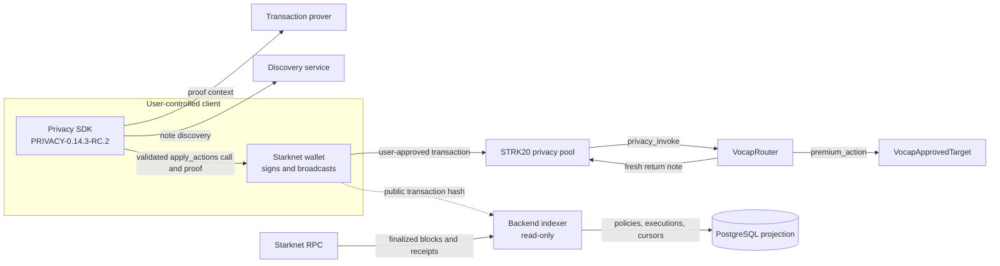

# VOCAP

VOCAP turns a private STRK20 capability into a checked, reusable action on Starknet.

V1 supports one lifecycle: a user supplies a private STRK20 note, the configured action runs, and the same amount returns to a fresh private note. The Router accepts one approved target and one policy-defined selector. The backend indexes public chain results. It never signs a transaction.

## Current status

The frozen V1 Router, approved target, and policy are deployed on Starknet Mainnet. The approved Mainnet lifecycle completed with three successful Router executions, private succession from Alice to Bob, and a safe spent-note replay rejection. The three proof hashes are recorded in [`strk20.json`](strk20.json).

The active client uses the official Starknet Privacy release [`PRIVACY-0.14.3-RC.2`](https://github.com/starkware-libs/starknet-privacy/releases/tag/PRIVACY-0.14.3-RC.2) at commit `9bfeb8dd35565a2915a0617dff3f649bd5bb891a`. The full client suite passed 259 tests across 28 files. The live prover and discovery endpoints report the RC2 protocol and pass the proof flow. They do not expose immutable image digests, so that provenance limit remains open.

The public repository contains the contracts, backend, tests, deployment configuration, and verified proof record. Detailed wallet, fee, service, and release handoff files are personal operator records. They remain in the local ignored `docs/` directory and are not published here.

## Architecture



The client creates the proof context and asks the connected wallet to approve the final pool call. The pool is the only caller allowed to enter the Router. The Router checks the policy, calls the approved target, and grants the pool the approval needed to return the capability. The indexer sees finalized blocks and Router events, then writes a replayable PostgreSQL projection.

## On-chain components

| Component | Responsibility |
| --- | --- |
| `VocapRouter` | Stores owner-created policies and accepts `privacy_invoke` only from the configured STRK20 pool. It binds token, amount, target, selector, and note id, blocks reentrancy, accounts for token surplus, and requires the capability to return. |
| `VocapApprovedTarget` | Exposes `premium_action()` to the Router and increments a public action counter. Direct callers are rejected. |
| STRK20 privacy pool | Holds the upstream note and proof lifecycle. It calls the Router during a proven private action and receives the fresh return note. |
| Backend indexer | Reads successful finalized receipts, parses Router events, tracks transaction status, and advances router-scoped cursors atomically. |

The policy boundary is public by design. The token, amount, target, selector, transaction boundary, and target action count can be observed. Holder state and note transfers are handled by the STRK20 privacy flow.

## Verified Mainnet deployment

| Contract | Mainnet address |
| --- | --- |
| `VocapRouter` | `0x6048ed36607367ea5ae050c745d47006214ecf66fdbf173d01eba96ec5d780a` |
| `VocapApprovedTarget` | `0x74637f577350898c64835c88216df3030050828c723c6987a3d97d6d4eb986b` |

The deployed policy uses the Mainnet STRK token, amount `1 STRK`, selector `premium_action`, and an empty target-calldata span.

The three application proof transactions are:

1. [`0x3e1acf0c893cb5697d48295d629e86fdddd1f8ff1fd1d307c7f2ecab8c7616f`](https://starkscan.co/tx/0x3e1acf0c893cb5697d48295d629e86fdddd1f8ff1fd1d307c7f2ecab8c7616f)
2. [`0x290d3683e674714a79676be0fc13819fc410e0b7e3abb2551529e28a52f83e0`](https://starkscan.co/tx/0x290d3683e674714a79676be0fc13819fc410e0b7e3abb2551529e28a52f83e0)
3. [`0xd4be56bfd8b0402e150ced5ee7f8b9c912722f9e4e940d1cc1eda7ee2098d3`](https://starkscan.co/tx/0xd4be56bfd8b0402e150ced5ee7f8b9c912722f9e4e940d1cc1eda7ee2098d3)

Each receipt is `SUCCEEDED` and `ACCEPTED_ON_L2`. The proof hashes and contract addresses are also present in [`strk20.json`](strk20.json). A public demo URL and demo video are not included until real URLs exist.

## Repository layout

```text
contracts/                 Cairo Router, target, and Starknet Foundry tests
backend/                   TypeScript indexer, persistence, health, and wallet boundary
.github/workflows/          Protected Mainnet indexer workflow
render.yaml                Supervised Sepolia web service blueprint
.env.example               Public configuration shape with no secrets
strk20.json                Verified Mainnet proof hashes and contract addresses
```

The local `docs/` directory is intentionally ignored. It contains operator-only release records and stays on the deployment machine.

## Run the checks

### Cairo contracts in WSL 2

Use the pinned Scarb and Starknet Foundry toolchain from `.tool-versions`.

```text
wsl.exe -d Ubuntu
cd /mnt/c/Users/<windows-user>/Desktop/VOCAP/contracts
export PATH="$HOME/.local/bin:$HOME/.asdf/shims:$PATH"
scarb build
snforge test
```

### Backend

The backend requires Node.js 24 and uses Corepack to run pnpm.

```text
cd backend
corepack pnpm install --frozen-lockfile
corepack pnpm typecheck
corepack pnpm test
corepack pnpm build
```

The PostgreSQL integration test is guarded by default. Set `VOCAP_TEST_DATABASE_URL` to a disposable database and `VOCAP_REQUIRE_POSTGRES=1` when you want to run it.

## Configuration and safety

Copy `.env.example` to a local ignored environment file and fill in the public RPC, network, Router, database, and start-block values. The backend accepts no signer configuration. The wallet remains the write boundary, and the privacy SDK keeps viewing-key handling in the user-controlled client.

Never commit or print private keys, viewing keys, seed phrases, wallet exports, authenticated RPC URLs, database passwords, or proof-signing material. The Mainnet indexer runs with a restricted PostgreSQL role and reads finalized Starknet receipts only. It has no wallet signer and no authority to submit transactions.

The Render blueprint is for the supervised Sepolia service. Mainnet uses the protected [`VOCAP Mainnet indexer workflow`](.github/workflows/vocap-mainnet-indexer.yml) with Neon Free PostgreSQL and scheduled GitHub-hosted runners.

## Scope and limits

- V1 supports `RETURN` only.
- The reviewed target has no inputs. Arbitrary target calldata is outside the V1 path.
- There is no frontend in this repository. The wallet and client flow are intentionally separate from the indexer.
- Local tests and the recorded Mainnet lifecycle are project evidence, not a third-party security audit.
- External service image provenance remains unverified because the live endpoints expose no immutable digest or revision.

## License

MIT
